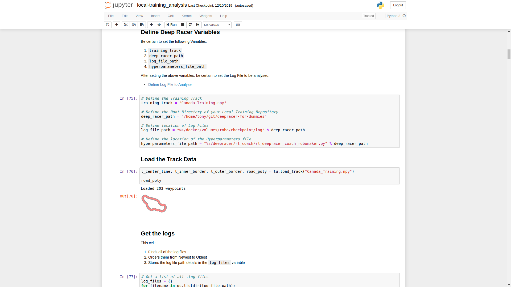

# Local Training analysis for DeepRacer

## Contents:

1. [Start Jupyter Notebook](#Start-Jupyter-Notebook)
2. [Define Deep Racer Variables](#Define-Deep-Racer-Variables)
3. [Define Log File to Analyse](#Define-Log-File-to-Analyse)


## Start Jupyter Notebook
    
1. Using a terminal window, start the Jupyter Notebook Server: 

    ```terminal
    jupyter notebook
    ```
    
2. Using your browser of choice, open the http link that is outputted to your terminal window from step 1.
    * Expect the link to look similar to this:
    
        ```terminal
       http://localhost:8888/?token=a83bae3462a7f8dd25e802254eef82023517945983a0f325
       ``` 

3. Use the web page that is displayed to navigate to `aws-deepracer-workshopd/log-analysis`

    
    
    
    
    

4. Use the web page that is displayed to open to `local-training_analysis.ipynb`
    
    

## Define Deep Racer Variables

1. In the `How-To-Use` area at the top of the Notebook, click on the first link to `Define Deep Racer Variables`.
2. Edit the Four Variables in this section to match your environment: 

    ```python
    # Define the Training Track
    training_track = "Canada_Training.npy"
    
    # Define the Root Directory of your Local Training Repository
    deep_racer_path = "/home/tony/git/deepracer-for-dummies"
    
    # Define location of Log Files
    log_file_path = "%s/docker/volumes/robo/checkpoint/log" % deep_racer_path
    
    # Define the location of the Hyperparameters file
    hyperparameters_file_path = "%s/deepracer/rl_coach/rl_deepracer_coach_robomaker.py" % deep_racer_path
    ```
   
   

## Define Log File to Analyse

1. Just below the `Define Deep Racer Variables` cell, click on the link to navigate to `Define Log File to Analyse`.
2. Set the log file to analyse.
    * The latest Log File would be: `log_files[0][0]`
    * The 2nd last Log File would be: `log_files[0][1]`
    * etc... 

        ```python
        # Set the Latest Log File as the one to be analysed
        fname = log_files[0][0]
        ```
      
      
